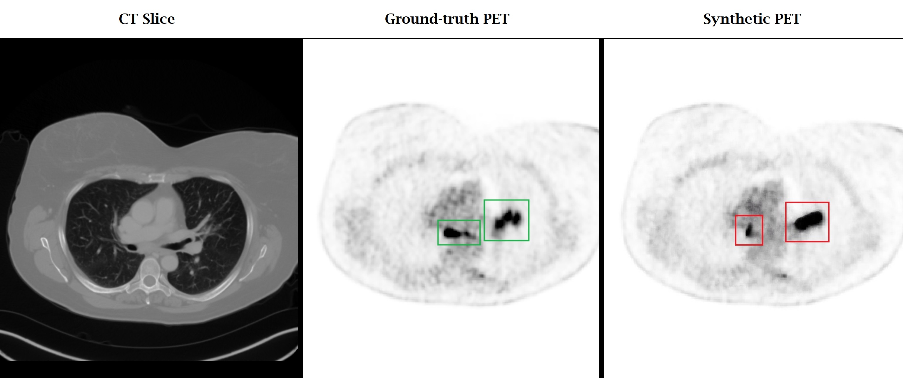
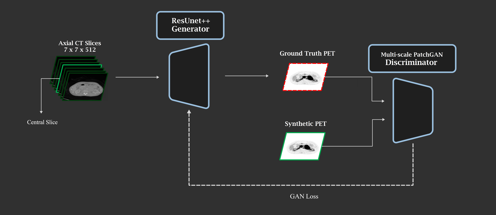

# Whole-body PET from CT
This is the code for following master's thesis at [Amirkabir University of Technology](https://phee.aut.ac.ir): 

**Synthetic Whole-body PET Image Generation from CT Using a cGAN with a Multi-scale Discriminator** 
- Alireza Mahmoodi
<div align=center></div>

This repository implements a model to generate synthetic PET images from CT scans using a conditional GAN framework. The model employs a ResUNet++ generator and a multi-scale PatchGAN discriminator. The research is inspired by the paper published in [Cell Reports Medicine](https://doi.org/10.1016/j.xcrm.2024.101463) by Salehjahromi et al. The codebase is forked from [Synthetic PET from CT](https://github.com/WuLabMDA/Synthetic-PET-from-CT/) and integrates modifications for handling multi-scale discriminator and efficient testing workflows.

## Features

- **Multi-Channel Input**: Supports CT data arrays with seven consecutive axial slices (512x512x7).
- **ResUNet++ Generator**: Utilizes a ResUNet++ architecture for the generator (Initial weights borrowed from Salehjahromi et al.)
- **Mullti-scale Discriminator**: Employs a multi-scale PatchGAN for adversarial training (Architecture borrowed from Nvidia's Pix2pixHD)
- **Customizable Options**: Easily configurable training and testing options through command-line arguments.
<div align=center></div>
<div align=center></div>

## Prerequisites

- **Hardware**: A machine with an Nvidia GTX or RTX series GPU supporting CUDA 10.1 or higher is recommended (Tested also with CUDA 12.4).
- **Software**: Python 3.9, PyTorch 2.5.0, torchvision 0.20.0 and other dependencies listed in the `environment.yml`.

The codebase successfully ran with two different environments. The first environment utilized Python 3.7 with CUDA 10.1 and PyTorch 1.7.1, a configuration suitable for legacy GPUs and older dependencies. In contrast, the second environment leveraged Python 3.9, CUDA 12.4, and PyTorch 2.5.0 for newer setups compatibility. The `environment.yml` file contains the latest environment setup. Set up the environment using:
```bash
conda env create -f environment.yml
conda activate cttopet-pix2pixhd
```

---

## Training the Model

### Data Preparation
Organize the data as follows:
```
data_7CHL/pix2pix_7Ch7/
├── trainA/   # CT data
├── trainB/   # PET data
├── testA/   # PET test data
├── testB/   # PET test data
├── valA/     # CT validation data
├── valB/     # PET validation data
```

Copy latest_net_G.pth from checkpoints folder to this path before execution:
```
code/experiment_name/latest_net_G.pth
```
This ensures loading generator weights from the pre-trained model.

### Training Command
Train the model with:
```bash
python train.py --batch_size 4
```
Set a smaller batch size for poor GPU memories.

### Notes
- Specify the GPU with `CUDA_VISIBLE_DEVICES`, e.g., `CUDA_VISIBLE_DEVICES=0 python train.py`.
- Use `--checkpoints_dir` to specify the directory for saving checkpoints.

---

## Testing the Model

### Pre-Trained Model
The pre-trained model achieving results reported in the paper is available in the `checkpoints` folder.

### Testing Command
Test the model with:
```bash
python testNifty.py --dataroot 'Folder_with_whole_body_CT_Nifti_files_inside' --name 'checkpoints' --mode 'test' --preprocess_gamma 1 --results_dir 'Result_folder'
```

After running:
1. Input NIfTI files are converted to temporary numpy arrays (`512x512x7`) in a `temp_folder` inside the input folder.
2. Synthetic PET numpy arrays are saved in `/Result_folder`, followed by a NIfTI file.

---

## Options

### Shared Options
- **`--dataroot`**: Root directory for data.
- **`--gpu_ids`**: Specify GPU(s) to use (e.g., `0` or `0,1`).
- **`--input_nc`**: Number of input channels (default: `7` for multi-channel CT data).
- **`--output_nc`**: Number of output channels (default: `1` for PET images).
- **`--batch_size`**: Batch size during training/testing.
- **`--checkpoints_dir`**: Directory for saving/loading checkpoints.

### Training Options
- **`--lr`**: Initial learning rate (default: `0.0002`).
- **`--n_epochs`**: Number of epochs to train before learning rate decay.
- **`--lambda_L1`**: Weight for L1 loss (default: `4000`).
- **`--gan_mode`**: Type of GAN loss (`vanilla`, `lsgan`, or `wgangp`).

### Testing Options
- **`--results_dir`**: Directory to save results.
- **`--num_test`**: Number of test images (default: `100`).

---

## Links

Dataset: [A whole-body FDG-PET/CT Dataset with manually annotated Tumor Lesions](https://doi.org/10.1038/s41597-022-01718-3)


## Citation

If you use this codebase, please cite:
```
@inproceedings{****,
  title={****},
  author={****},
  booktitle={****},
  volume={****},
  number={****},
  pages={****},
  year={****}
}
```


## Acknowledgments

- **Codebase**: [Salehjahromi](https://github.com/WuLabMDA/Synthetic-PET-from-CT/)
- **Discriminator Architecture**: [pix2pixHD](https://github.com/chenxli/High-Resolution-Image-Synthesis-and-Semantic-Manipulation-with-Conditional-GANsl-).

